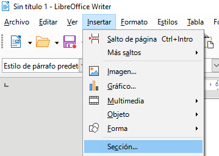

## Seccions en LibreOffice Writer

Una **secció** és una part d’un document que es vol tractar com un bloc independent, amb un format específic o diferent del format de la resta del document. Les seccions permeten dividir un document per aplicar diferents configuracions a cada part, com ara marges, columnes, o proteccions.

### Característiques principals de les seccions:

- **Format personalitzat**: Cada secció pot tenir un format diferent pel que fa a columnes, fons, alineament, etc.
- **Divisió del document**: Permet crear segments separats per aplicar configuracions diferents, com diferents estils de pàgina o dissenys de columnes.
- **Protecció del contingut**: Es poden protegir les seccions perquè el text no es pugui editar o perquè quedi amagat.
- **Connexió entre seccions**: Pots vincular seccions entre elles per gestionar el flux del text d'una secció a una altra.

### Creació d’una nova secció

Per crear una nova secció al document:

1. Aneu al menú **Insertar**.
2. Seleccioneu l’opció **Secció**.
3. A la finestra que apareix, podeu configurar els paràmetres de la secció, com ara:
    - **Nom**: Doneu un nom a la secció per identificar-la fàcilment.
    - **Columnes**: Configureu la secció per tenir una o diverses columnes.
    - **Protecció**: Podeu protegir la secció per evitar que es pugui editar o amagar-la.

Un cop creada la secció, aquesta apareixerà com una part separada dins del document, amb les configuracions que heu definit.

### Modificació d’una secció

Si voleu modificar una secció ja creada:

1. Feu clic dins de la secció.
2. Aneu al menú **Formato \ Sección**.
3. Aquí podeu canviar les propietats de la secció, com ara el nombre de columnes, la protecció o el fons.

### Ús de seccions per a format avançat

Les seccions són útils en diverses situacions on es vol tenir un control detallat sobre el disseny del document:

- **Canvi de columnes dins del mateix document**: Podeu tenir una part del document amb una columna i una altra amb dues o més columnes.
- **Protecció del contingut**: Podeu protegir parts del document per evitar que es modifiquin per error, o fins i tot amagar seccions que només es mostrin sota determinades condicions.
- **Control del flux de text**: Si una secció no té prou espai per al text, podeu vincular-la amb una altra secció perquè el text excedent flueixi automàticament cap a la següent secció.

### Eliminar una secció

Per eliminar una secció:

1. Aneu al menú **Formato \ Sección**.
2. Seleccioneu la secció que voleu eliminar i feu clic a **Eliminar**. Això no esborrarà el contingut, només la divisió de la secció.

Les seccions són una eina poderosa per controlar el format i la presentació del document, permetent aplicar configuracions flexibles sense afectar la resta del text.
