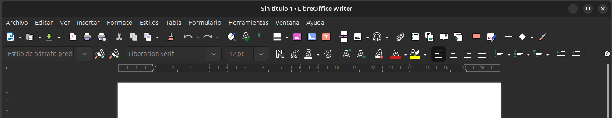

# Entorn de treball de Writer de LibreOffice

Quan inicieu **LibreOffice Writer**, observareu que la seva finestra està composta per diversos elements que us ajudaran a gestionar i editar documents de manera eficient. A continuació, us expliquem les principals àrees de treball que trobareu a la interfície.

## 1. Barra de títols
La **barra de títols** es troba a la part superior de la finestra i mostra el nom del document actiu i el nom del programa. Aquesta barra canviarà de nom segons si heu desat el document o no. En cas que estigueu treballant en un document nou, apareixerà com a "Sense títol".

**Imatge suggerida:** Una captura de pantalla que mostri la barra de títols amb el nom del document visible.

---

## 2. Barra de menús
La **barra de menús** està situada just sota la barra de títols i agrupa tots els comandaments del processador de textos per categories, com ara **Fitxer**, **Edita**, **Visualitza**, **Eines**, entre d'altres. Aquí podreu trobar les opcions per desar, imprimir, configurar el document, entre moltes altres accions.

**Imatge suggerida:** Captura de pantalla de la barra de menús amb les opcions desplegades.

---

## 3. Barres d'eines: Estàndard i Formateig
Les **barres d'eines Estàndard** i **Formateig** són conjunts d'icones que permeten executar de manera ràpida els comandaments més utilitzats. Aquestes barres són molt útils per a accions freqüents com desar documents, copiar i enganxar, canviar el tipus de lletra, o ajustar l'alineació del text. A més, les barres d'eines es poden personalitzar, amagar, mostrar i moure segons les vostres preferències.

### - Barra d'eines Estàndard
Ofereix accés ràpid a funcions generals com desar, obrir, imprimir, copiar, i altres accions bàsiques d'edició.

### - Barra d'eines de Formateig
Permet ajustar l'aparença del text, com ara el tipus de lletra, el color, la mida, l'alineació, etc.

**Imatge suggerida:** Captura de pantalla on es mostren les barres d'eines Estàndard i Formateig.

---

## 4. Barres de desplaçament: Horitzontal i Vertical
Les **barres de desplaçament** estan situades a la dreta (vertical) i a la part inferior (horitzontal) de la finestra de Writer. Permeten desplaçar-se per les diferents parts del document que no estan visibles a la pantalla. Aquests controls són útils especialment en documents llargs, on es pot navegar fàcilment entre pàgines.

**Imatge suggerida:** Una captura de pantalla que mostri les barres de desplaçament amb un document llarg.

---

## 5. Elements de navegació
Els **elements de navegació** permeten saltar d'un element a l'altre dins del document, com ara pàgines, taules, marcs de text, gràfics o encapçalaments. Aquests elements són accessibles des de la barra de desplaçament vertical, i ajuden a moure’s ràpidament dins del document sense haver de desplaçar-se manualment.

**Imatge suggerida:** Captura de pantalla que mostri els botons d'elements de navegació en acció.

---

## 6. Regles horitzontal i vertical
Les **regles horitzontal i vertical** són visibles a la part superior i esquerra de l'àrea de treball. Aquestes regles ajuden a controlar la posició dels elements al document, com ara les tabulacions, sagnats, i marges del text.

**Imatge suggerida:** Una captura de pantalla de les regles que mostri els marges i les tabulacions.

---

## 7. Barra d'estat
La **barra d'estat** es troba a la part inferior de la finestra de Writer i proporciona informació rellevant sobre el document que s'està editant. Mostra detalls com el número de pàgina, el nombre total de paraules, l'idioma de revisió ortogràfica, i altres elements útils per a l'edició. A més, podeu accedir a funcions addicionals seleccionant el menú **Ajuda** > **Què és això?** o prement **Majúscules+F1**.

**Imatge suggerida:** Una captura de pantalla de la barra d'estat amb totes les seves seccions visibles.

