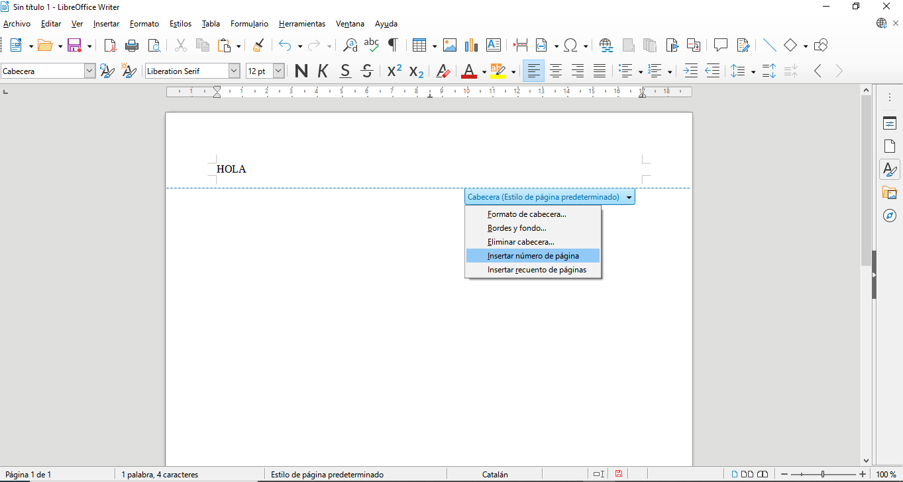
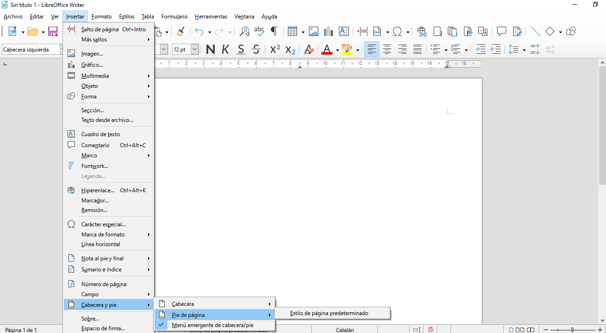

## Capçaleres i peus de pàgina en LibreOffice Writer

Les capçaleres i peus són àrees situades als marges superior i inferior de les pàgines, on es poden inserir elements com text, números de pàgina, imatges, i altres camps.

### Com afegir capçaleres i peus de pàgina

Per afegir capçaleres o peus en un document de Writer:

1. Aneu al menú **Insertar**.
2. Seleccioneu **Capçalera i Peu de pàgina**.
3. Trieu si voleu afegir una **Capçalera** o un **Peu de pàgina** per al vostre estil de pàgina actual.

Un cop afegits, podeu editar directament el contingut de la capçalera o el peu de pàgina. Podeu inserir text, imatges, o altres elements com números de pàgina o data.

### Afegir números de pàgina

1. Aneu al menú **Insertar**.
2. Seleccioneu **Número de pàgina** per afegir automàticament la numeració en totes les pàgines.
3. El número de pàgina apareixerà dins de la capçalera o el peu de pàgina, segons on l’hàgiu inserit.

### Ús de diferents capçaleres i peus per a diferents pàgines

Podeu definir capçaleres i peus diferents per a les pàgines parelles i senars, o per a seccions específiques del document:

1. Aneu al menú **Formato \ Estilo de página**.
2. A la pestanya **Capçalera** o **Peu de pàgina**, marqueu **Capçalera diferent per a pàgines esquerres/dretes** o **Primera pàgina diferent**.
3. Això us permetrà personalitzar les capçaleres o peus de pàgina per a diferents seccions del document o per a la primera pàgina.

### Personalitzar el contingut de les capçaleres i peus

A més de números de pàgina, podeu inserir altres camps automàtics dins de les capçaleres o peus, com:

- **Data i hora actual**: S’actualitza automàticament cada vegada que es visualitza o imprimeix el document.
- **Nom del document** o **Ruta del fitxer**: Mostra el nom i la ubicació del fitxer.

Per inserir camps automàtics:
1. Aneu al menú **Insertar**.
2. Seleccioneu **Camp** i trieu el camp que voleu inserir (com Data, Hora, Número de pàgina, etc.).

### Estils de capçaleres i peus

Podeu formatar el text dins de les capçaleres o peus utilitzant estils personalitzats, tal com ho faríeu amb qualsevol altre text al document:

- Canvieu la **font**, **mida de la lletra**, o **color** del text.
- Afegiu **imatges** o **logotips** si voleu un disseny més elaborat.

Amb aquestes eines, podeu gestionar de manera efectiva la presentació de les capçaleres i peus de pàgina en els vostres documents.
