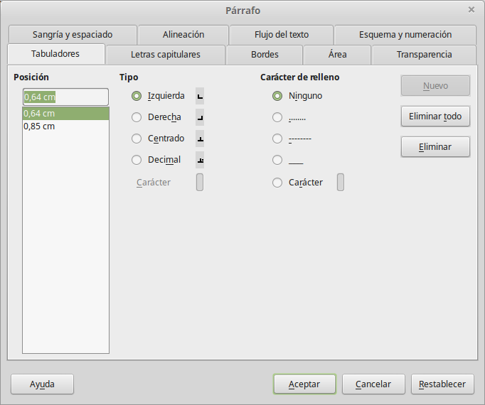
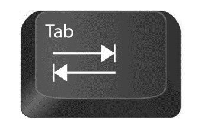

## Tabuladors

Els **tabuladors** permeten alinear el text de manera precisa en els documents. Es poden utilitzar per crear taules simples, llistes, o per alinear elements com números, textos o símbols dins d'una línia de text. Els tabuladors són específics per a cada paràgraf i es poden definir des de la regla horitzontal situada a la part superior de l'àrea de treball.

### Tipus de Tabuladors

LibreOffice Writer ofereix quatre tipus de tabuladors que podeu utilitzar per alinear el vostre text:

- **Tabulador esquerra**: Alinea el text cap a la dreta a partir de la posició del tabulador. El text comença just on es col·loca el tabulador i s'estén cap a la dreta.
   
- **Tabulador centrat**: Alinea el text de manera que el centre del text coincideix amb la posició del tabulador.

- **Tabulador dreta**: Alinea el text cap a l'esquerra des de la posició del tabulador. És útil per a números, perquè les xifres més llargues es mouen cap a l'esquerra i mantenen la seva alineació a la dreta.

- **Tabulador de punt decimal**: Alinea els números per la coma o punt decimal. Això és especialment útil quan treballeu amb llistes numèriques o columnes de quantitats, ja que assegura que els decimals estiguin sempre alineats.




### Com configurar els tabuladors

#### Definir tabuladors des de la regla

Per definir els **tabuladors** en un document de Writer, seguiu els passos següents:

1. **Seleccioneu el text** o el paràgraf on voleu afegir tabuladors.
2. Aneu a la **regla horitzontal** que es troba a la part superior de la finestra de Writer.
3. Feu clic sobre la regla en la posició on voleu col·locar un tabulador. Apareixerà un petit símbol que representa el tipus de tabulador.
4. Si necessiteu canviar el tipus de tabulador, feu clic dret sobre el símbol del tabulador a la regla i trieu el tipus que necessiteu (esquerra, centrat, dreta o punt decimal).
5. Per eliminar un tabulador, simplement arrossegueu el símbol del tabulador fora de la regla.

#### Definir tabuladors des del menú de paràgraf

A més de configurar els **tabuladors** utilitzant la **regla horitzontal**, també podeu definir-los accedint al menú de **Paràgraf**. Aquesta opció us ofereix un major control sobre la configuració dels tabuladors i us permet establir-ne diversos amb precisió, així com configurar opcions addicionals.

1. **Seleccioneu el text** o el paràgraf on voleu aplicar els tabuladors.
   
2. Aneu al menú superior i seleccioneu **Format** > **Paràgraf**. També podeu fer clic dret al text seleccionat i triar l'opció **Paràgraf** del menú contextual.

3. A la finestra emergent **Paràgraf**, seleccioneu la pestanya **Tabuladors**.

4. A la secció **Posició de tabuladors**, podeu especificar manualment la posició exacta del tabulador en centímetres (o qualsevol altra unitat de mesura que estigui configurada).

5. Trieu el **tipus de tabulador** que voleu aplicar a la posició especificada. Els tipus de tabuladors disponibles són:
   - **Esquerra**: Alinea el text a la dreta a partir de la posició del tabulador.
   - **Dreta**: Alinea el text a l'esquerra des de la posició del tabulador.
   - **Centrat**: Centra el text sobre la posició del tabulador.
   - **Punt decimal**: Alinea els números respecte a la coma o punt decimal.

6. Podeu definir **farcits** (també coneguts com a punts de guia), que són caràcters que omplen l'espai entre el text i el tabulador. Hi ha diverses opcions disponibles, com ara punts (`.......`), guions (`------`) o espais en blanc.
   
7. Un cop definit el tabulador, feu clic a **Afegeix** per afegir-lo a la llista de tabuladors configurats.

8. Si voleu eliminar o modificar un tabulador existent, simplement seleccioneu-lo a la llista i utilitzeu els botons **Eliminar** o **Modificar**.

9. Quan hagueu definit tots els tabuladors desitjats, feu clic a **D'acord** per aplicar els canvis al text seleccionat.

### Exemple pràctic amb el menú de paràgraf

Si voleu configurar una alineació de productes i quantitats, podríeu definir un **tabulador d'esquerra** a 5 cm per a la columna de productes i un **tabulador de dreta** a 15 cm per a les quantitats. També podeu configurar punts com a farcits entre les dues columnes per facilitar la lectura:

1. **Tabulador esquerra** a 5 cm.
2. **Tabulador dreta** a 15 cm amb farcit de punts.

El resultat seria similar a:

```plaintext
Producte       ..........     Quantitat
Pomes          ..........     12
Taronges       ..........     8
Plàtans        ..........     15


### Ús de la tecla **TAB**

Un cop heu definit els tabuladors, podeu utilitzar la tecla **TAB** del teclat per moure el cursor entre les diferents posicions de tabulació definides. Això us permetrà alinear el text fàcilment a les posicions establertes.



**Nota:** Cada cop que premeu la tecla **TAB**, el cursor saltarà a la següent posició de tabulació definida a la regla horitzontal.

### Exemple pràctic

Si voleu crear una taula senzilla d'elements alineats, com ara noms amb les seves quantitats corresponents, podeu definir un tabulador d'esquerra per als noms i un de dreta per als números. Això garantirà que els noms estiguin alineats a l'esquerra i els números a la dreta.

```plaintext
Producte               Quantitat
-------------------------------
Pomes                  12
Taronges               8
Plàtans                15
