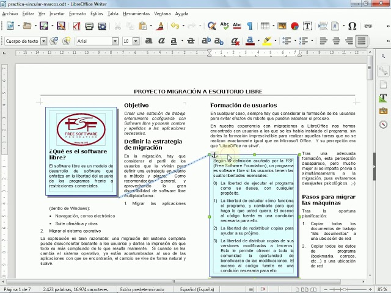

## Marcs en LibreOffice Writer

Els **marcs** són una eina molt útil dins de **LibreOffice Writer** per gestionar elements del document que necessiten un tractament especial o diferenciat. Un marc és una àrea del document, definida per l’usuari, que pot contenir text, imatges, o altres objectes, i es tracta de manera independent de la resta del document.

### Què és un marc?

Un **marc** és una àrea delimitada dins del document que permet introduir contingut, com ara text o imatges, que es pot gestionar de forma diferenciada. Els marcs són especialment útils quan es necessita que una part del contingut tingui un format diferent o s'ha de situar en una posició específica a la pàgina, sense afectar la resta del text.

Característiques dels marcs:

- El **text** o **imatges** dins d'un marc poden tenir un format diferent del que s'aplica al document principal.
- Els **marcs** es poden **moure, redimensionar, formatar** i personalitzar de manera independent.
- Els marcs es poden utilitzar per a **disposicions complexes**, com ara text en columnes o l'ús d'imatges i llegendes que no alterin el flux principal del document.
- Els marcs també poden contenir altres objectes, com **taules, gràfics** o **objectes incrustats**.

### Inserir un marc

Per inserir un **marc** a **Writer**, seguiu aquests passos:

1. Aneu al menú **Insereix** > **Marc** > **Marc...**.
   
2. Apareixerà una finestra de diàleg que permet configurar les propietats inicials del marc:
   - **Posició i mida**: Podeu definir la ubicació exacta del marc a la pàgina i les seves dimensions.
   - **Opcions de text**: Podeu decidir si voleu que el text del document principal flueixi al voltant del marc o si voleu mantenir el marc separat.
   - **Bordes i fons**: És possible personalitzar els bordes del marc, així com el color de fons.

3. Un cop configurades les opcions, feu clic a **D'acord** i el marc s'inserirà al document.

### Formatació del text dins del marc

El contingut d'un **marc** es pot formatar de manera independent del text del document principal. Podeu aplicar diferents tipus de formatacions com:

- **Tipus de lletra**, mida, color i altres propietats de text.
- **Sagnat** i **espaiat** diferent del document principal.
- Inserir **imatges**, **taules**, o **gràfics** dins del marc amb el seu format propi.

### Vincular marcs

Una de les funcionalitats avançades dels marcs és la possibilitat de **vincular-los** per a crear un flux de text continu entre diferents marcs. Això és especialment útil quan es treballa amb documents en format de revista, newsletters o altres dissenys que requereixen que el text flueixi d'un marc a un altre.

Per **vincular dos marcs**:

1. Inseriu dos o més marcs al document.
2. Seleccioneu el primer marc.
3. A la barra d’eines de **Marcs**, feu clic a la icona **Enllaça marcs**.
4. Feu clic sobre el segon marc on voleu que continuï el text.
   
Un cop enllaçats, el text que no càpiga al primer marc fluirà automàticament al segon marc, i així successivament si enllaçeu més marcs.

### Propietats avançades dels marcs

Els marcs en **Writer** tenen una sèrie de propietats avançades que permeten un control més detallat sobre el seu comportament i aparença:

- **Posició relativa**: Podeu definir la posició del marc respecte a la pàgina, el marge, el paràgraf o el caràcter.
- **Flux de text**: Podeu controlar com el text principal del document flueix al voltant del marc, com ara ajustos de text automàtics o configuració personalitzada per evitar que el text sobrepassi el marc.
- **Opcions de fixació**: Podeu fixar el marc a un paràgraf concret o deixar-lo flotant perquè es mogui de forma més flexible dins del document.
- **Bordes, ombres i fons**: Personalitzeu el disseny visual del marc amb colors de fons, bordes de diferents amplades i estils, o fins i tot afegiu una ombra.

### Ús pràctic dels marcs

Els marcs són extremadament útils en una varietat de contextos:

- **Columnes de text**: Per crear columnes no alineades en el mateix document.
- **Elements decoratius**: Posicionar imatges o gràfics en parts específiques del document.
- **Cites o text destacat**: Crear quadres de text destacat que no alteren el format principal del document.
- **Notícies o revistes**: Vincular marcs per fer que el text flueixi de manera contínua entre seccions o pàgines diferents.

### Exemple pràctic

Imagineu que voleu inserir un marc amb una cita destacada al mig del vostre document. Seguiu aquests passos:

1. Inseriu un marc a la posició desitjada del document.
2. Introduïu el text de la cita dins del marc.
3. Apliqueu un format diferenciat, com ara un tipus de lletra més gran o en cursiva.
4. Configureu el flux de text perquè el contingut principal flueixi al voltant del marc sense interferir-hi.

El resultat final seria un text principal que envolta la cita destacada dins del marc, mantenint un aspecte organitzat i professional.

---

