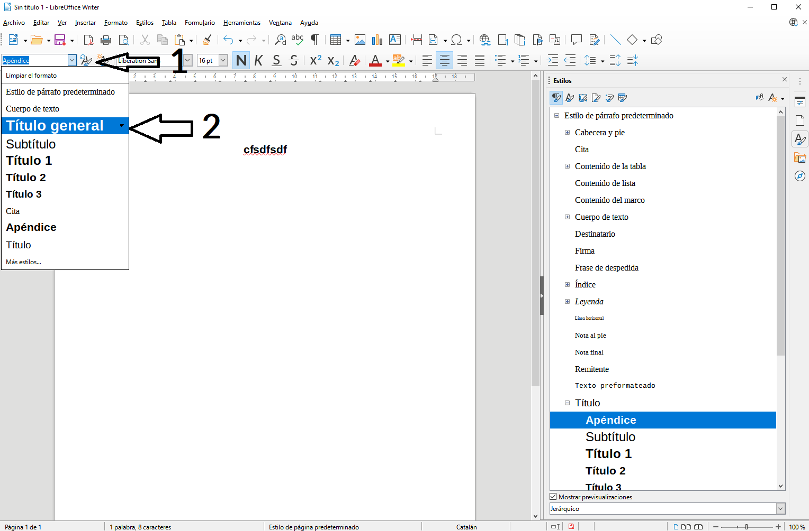

## Treball amb estils en LibreOffice Writer

Els **estils** són eines fonamentals en **LibreOffice Writer** que permeten mantenir la uniformitat i coherència de format dins d'un document. A més, l'ús adequat d'estils facilita funcions avançades com l'**autogeneració d'índexs**, la gestió ràpida del format i l'aplicació de canvis globals a tot el document de manera eficient.

### Què són els estils?

Els **estils** defineixen una sèrie de propietats de format predefinides que s'apliquen a diversos elements del document, com ara paràgrafs, caràcters, marcs, pàgines i llistes. Aplicant estils, podeu modificar fàcilment l'aparença de tot un document o seccions específiques, sense haver de canviar manualment el format de cada part.

#### Beneficis d'utilitzar estils:

- **Uniformitat**: Tots els elements amb el mateix estil es veuran iguals al llarg del document.
- **Eficiència**: Modificant un estil, es reflectiran els canvis a tots els elements que utilitzen aquest estil.
- **Flexibilitat**: Els estils permeten canvis massius de format, com ara actualitzar totes les capçaleres o llistes amb un sol clic.
- **Autogeneració d'índexs**: Els estils de paràgraf, especialment els títols, permeten que el document generi automàticament taules de continguts basades en l'estructura del text.

### Tipus d'estils en LibreOffice Writer

LibreOffice Writer ofereix cinc tipus principals d'estils, cadascun dels quals permet controlar aspectes específics del format:

#### Estils de paràgraf

Els **estils de paràgraf** defineixen com es presenta i s'estructura un paràgraf sencer. Les propietats inclouen:

- **Tipus de lletra** i les seves característiques.
- **Sagnat i espaiat** (marge dret i esquerre, espai entre paràgrafs).
- **Alineació** (esquerra, dreta, centrat, justificat).
- **Flux del text**, incloent salt de pàgina abans o després del paràgraf.
- **Tabulacions** i ajustos especials com **inicials destacades**.
- **Fons de paràgraf** i **contorns**.

Exemple: Podeu definir un estil per a tots els títols del document perquè tinguin un tipus de lletra més gran, en negreta i amb espaiat addicional abans del paràgraf.

#### Estils de caràcter

Els **estils de caràcter** controlen les propietats individuals dels caràcters dins del text, sense afectar tot el paràgraf. Les opcions inclouen:

- **Tipus de lletra**, mida, color i altres efectes (negreta, cursiva, subratllat).
- **Efectes especials** com lletres en superíndex o subíndex.
- **Característiques del fons** del text, com color o contorns.

Exemple: Podeu aplicar un estil de caràcter per destacar una part del text, com un terme tècnic, canviant el color i aplicant cursiva.

#### Estils de marc

Els **estils de marc** defineixen les propietats dels marcs utilitzats dins del document, com ara:

- **Grandària i posició** del marc a la pàgina.
- **Ajust respecte al text** del document principal (el text pot envoltar el marc o mantenir-se separat).
- **Fons del marc** i **contorns**.
- Configuració de **columnes** dins del marc.

Exemple: Si utilitzeu marcs per a imatges o quadres de text, podeu definir estils que controlin el seu alineament, marges interns i bordes.

#### Estils de pàgina

Els **estils de pàgina** afecten el disseny global de la pàgina i inclouen:

- **Format del paper** (mida, orientació) i **marges**.
- **Encapçalat i peu de pàgina**.
- **Fons de la pàgina** i disseny de columnes.
- Configuració de les **notes al peu**.

Exemple: Podeu crear un estil per les pàgines inicials amb un encapçalat especial i una numeració diferent respecte a la resta del document.

#### Estils de llista

Els **estils de llista** controlen l'aparença de les llistes numerades o amb pics. Entre les propietats, trobem:

- Tipus de **numeració** o **pics** (cercles, quadrats, etc.).
- **Posició i espaiat** en funció del nivell de la llista.
- **Opcions de disseny** per a cada nivell de la llista.

Exemple: Podeu establir un estil per a llistes amb pics que utilitzi símbols personalitzats i un espaiat addicional entre cada element de la llista.

### Aplicar estils a un document

Podeu aplicar estils de diferents formes:

- **Barra d'eines**: Podeu utilitzar la barra d'estils per aplicar ràpidament un estil seleccionat al text o paràgraf actual.
- **Teclat**: Amb combinacions de tecles predefinides, podeu aplicar estils ràpidament.
- **Finestra d'Estils**: Aneu a **Estils** > **Gestionar estils** (o premeu **F11**). Seleccioneu la categoria d'estil (paràgraf, caràcter, marc, etc.), i després feu doble clic sobre l'estil que vulgueu aplicar.

#### Passos per aplicar un estil des de la finestra d'estils:

1. Seleccioneu el text o paràgraf al document al qual voleu aplicar l'estil. Si és un paràgraf, només cal que el punt d'inserció estigui dins del paràgraf.
2. Aneu a la finestra d'**Estils i format** (**F11**).
3. Seleccioneu la categoria d'estil que voleu aplicar (paràgraf, caràcter, etc.).
4. Doble clic sobre l'estil desitjat.

### Crear un estil nou

Crear un estil propi és útil quan necessiteu un format específic que no està inclòs en els estils predefinits. Seguiu aquests passos per crear un estil nou a partir d'una selecció existent:

1. Seleccioneu el text o element al qual voleu basar el nou estil.
2. Aneu a la finestra d'**Estils i format** i feu clic a la fletxa desplegable situada a la part superior esquerra.
3. Seleccioneu **Nou estil a partir de selecció**.
4. Doneu un nom a l'estil i premeu **D'acord**.

!!!note "Nota:" 
    El nou estil serà una còpia exacta del format del text seleccionat en aquell moment. Després, podeu modificar-lo si és necessari per ajustar-lo a les vostres necessitats.

### Modificar un estil existent

Per modificar un estil ja existent, seguiu aquests passos:

1. Aneu a la finestra d'**Estils i format** (**F11**).
2. Feu clic dret sobre l'estil que voleu modificar i seleccioneu **Modifica**.
3. A la finestra que s'obre, podeu ajustar les propietats de format segons les vostres necessitats.
4. Premeu **D'acord** per aplicar els canvis a tot el document.

---

