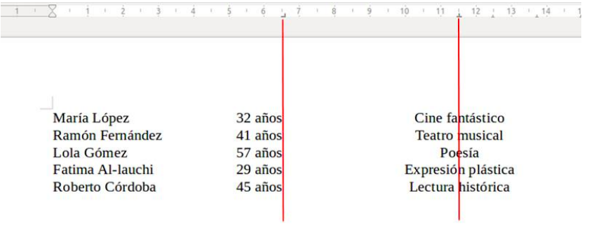
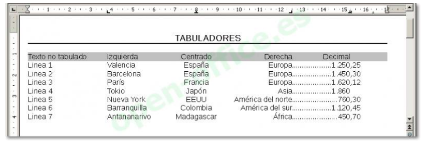

## Índex
1. [Introducció](#introduccio)
2. [Objectius](#objectius)
3. [Activitat 9](#activitat-9)
4. [Activitat 10](#activitat-10)
5. [Activitat 11](#activitat-11)
6. [Activitat 12](#activitat-12)

## Introducció

Aquesta pràctica ens introdueix en l'ús bàsic de LibreOffice, continuant amb funcions com les plantilles, els tabuladors i les llistes.

## Objectius

- Utilitzar plantilles.
- Treballar amb tabuladors.
- Crear i gestionar llistes.

\vfill

\begin{center}
\includegraphics[height=32pt]{../../../assets/llicencia.png}
\end{center}

\begin{center}
\footnotesize{
\textit{Apunts Aplicacions Ofimàtiques - 1SMX} by \href{https://github.com/abeneto}{Alberto Benetó} is licensed under \href{https://creativecommons.org/licenses/by-nc-sa/4.0/?ref=chooser-v1}{Creative Commons Attribution-NonCommercial-ShareAlike 4.0}
}
\end{center}

\newpage

## Activitat 9

### Objectiu:
Conèixer l'utilitat de les plantilles i gestionar-les correctament.

### Desenvolupament de l’activitat:

1. Obri el document `Certificado.odt`.
2. Dona-li format per a que es parega al fitxer `Sol_Act_09.pdf`.
3. Guarda’l com una plantilla a la carpeta **Mis plantillas**.
4. Tanca el document.

\begin{tcolorbox}[colback=customblue!5!white, colframe=customblue!80!black, title=Nota]
Guarda el document generat com `Act-9.odt`.
\end{tcolorbox}

---

## Activitat 10

### Objectiu:
Aprendre a utilitzar correctament els tabuladors.

### Desenvolupament de l’activitat:

1. Utilitzant correctament els **tabuladors** i els espais, crea un document igual al fitxer `Sol_Act_10.jpg`.
2. Recorda utilitzar **tabuladors** i NO espais en blanc.
3. Utilitza el farcit de punts automàticament amb els tabuladors, sense fer-ho manualment.

\begin{tcolorbox}[colback=customblue!5!white, colframe=customblue!80!black, title=Nota]
Guarda el document generat com `Act-10.odt`.
\end{tcolorbox}

---

## Activitat 11

### Objectiu:
Reproduir correctament l'ús dels tabuladors en diferents imatges.

### Desenvolupament de l’activitat:

1. Reprodueix els tabuladors de les dues imatges proporcionades en un nou document.

\begin{tcolorbox}[colback=customblue!5!white, colframe=customblue!80!black, title=Nota]
Guarda el document generat com `Act-11.odt`.
\end{tcolorbox}

---

## Activitat 12

### Objectiu:
Conèixer el funcionament de les llistes en LibreOffice.

### Desenvolupament de l’activitat:

1. Utilitza correctament les llistes per crear un document igual al fitxer `Sol_Act_12.pdf`.
2. Recorda que els punts i números han de ser producte d'aplicar una llista, no afegits manualment.

\begin{tcolorbox}[colback=customblue!5!white, colframe=customblue!80!black, title=Nota]
Guarda el document generat com `Act-12.odt`.
\end{tcolorbox}

---
