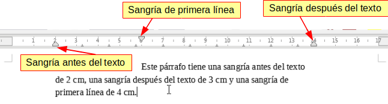

## Sangries

Les **sangries** en LibreOffice Writer són una eina fonamental dins dels formats de paràgraf que permet ajustar la posició del text dins del document. Aquestes configuracions us permetran controlar l'espai entre els marges de la pàgina i el text, tant per a tot el paràgraf com per a la primera línia, i així crear documents amb una estructura visual més clara i professional.

### Tipus de Sangries

LibreOffice Writer ofereix diverses opcions per aplicar sangries, adaptant-les a les vostres necessitats de formatació:

- **Sangria abans del text**: És l'espai entre el marge esquerre de la pàgina i l'inici del paràgraf. És especialment útil per ajustar l'alineació de blocs de text dins d'un document.
  
- **Sangria després del text**: És l'espai entre el marge dret de la pàgina i el final del paràgraf. Aquesta opció permet equilibrar el text dins de la pàgina, especialment en documents amb formats complexos o ajustats.

- **Primera línia**: Aquesta opció aplica una sangria exclusiva a la primera línia del paràgraf, creant un efecte visual que separa clarament els paràgrafs entre si.

### Com aplicar sangries

Per accedir a les opcions de **sangries** en Writer, seguiu els passos següents:

1. Seleccioneu el paràgraf o paràgrafs als quals voleu aplicar una sangria.
2. Aneu al menú superior i seleccioneu **Format** > **Paràgraf**.
3. A la finestra que apareix, seleccioneu la pestanya **Sangries i espaiat**.
4. Ajusteu els valors per a **Abans del text**, **Després del text** i **Primera línia** segons les vostres necessitats.
5. Feu clic a **D'acord** per aplicar els canvis.

### Configuració de les Sangries

#### Sangria abans del text

La **sangria abans del text** determina la distància entre el marge esquerre i el començament del paràgraf. Aquesta configuració és especialment útil en documents formals o acadèmics, on sovint és necessari crear blocs de text amb espais addicionals per millorar-ne la llegibilitat.

Per configurar-la:

1. Aneu a **Format** > **Paràgraf**.
2. A la secció de **Sangria**, introduïu el valor desitjat en el camp **Abans del text**.
3. Feu clic a **D'acord**.

#### Sangria després del text

La **sangria després del text** ajusta la distància entre el marge dret de la pàgina i el final del paràgraf. És útil per donar un aspecte més equilibrat al text, especialment en documents amb molt contingut gràfic o amb necessitats d'espaiat específic.

Per configurar-la:

1. Aneu a **Format** > **Paràgraf**.
2. Introduïu el valor desitjat en el camp **Després del text**.
3. Feu clic a **D'acord**.

#### Primera línia

La **sangria de la primera línia** és una de les tècniques més utilitzades per separar visualment els paràgrafs dins d'un text. En comptes d'afegir espai entre paràgrafs, la primera línia es desplaça lleugerament cap a dins, creant una diferenciació subtil.

Per configurar-la:

1. Aneu a **Format** > **Paràgraf**.
2. A la secció de **Sangria**, introduïu el valor desitjat en el camp **Primera línia**.
3. Feu clic a **D'acord**.

### Exemple pràctic: Aplicar una sangria a la primera línia

Suposem que voleu aplicar una sangria a la primera línia de cada paràgraf del vostre document per millorar-ne l'organització visual. Seguiu aquests passos:

1. Seleccioneu el paràgraf o els paràgrafs als quals voleu aplicar la sangria.
2. Aneu a **Format** > **Paràgraf**.
3. A la pestanya **Sangries i espaiat**, introduïu el valor **0,5 cm** en el camp **Primera línia**.
4. Feu clic a **D'acord** per aplicar els canvis.

Aquest ajust crearà un espaiat discret a l'inici de la primera línia de cada paràgraf, donant al document un aspecte més ordenat i llegible.

### Avantatges de les sangries

L'ús de les sangries en LibreOffice Writer ofereix diversos avantatges:

- **Clarificació visual**: Les sangries ajuden a organitzar el text, separant paràgrafs o blocs de contingut d'una manera visualment atractiva.
- **Professionalitat**: Els documents amb sangries ben aplicades semblen més professionals i ben estructurats.
- **Personalització**: Permet ajustar l'espaiat i la distribució del text segons les necessitats del document, ja sigui en documents formals, acadèmics o creatius.

Amb aquestes eines, podreu gestionar i formatar el vostre text amb més precisió i estètica, millorant tant l'aparença com la funcionalitat dels vostres documents.
