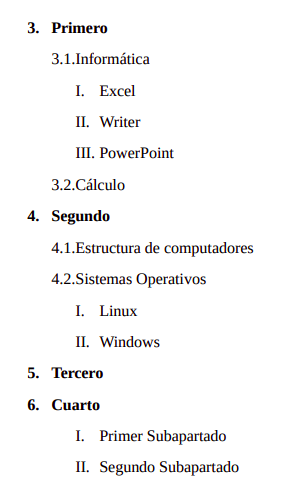
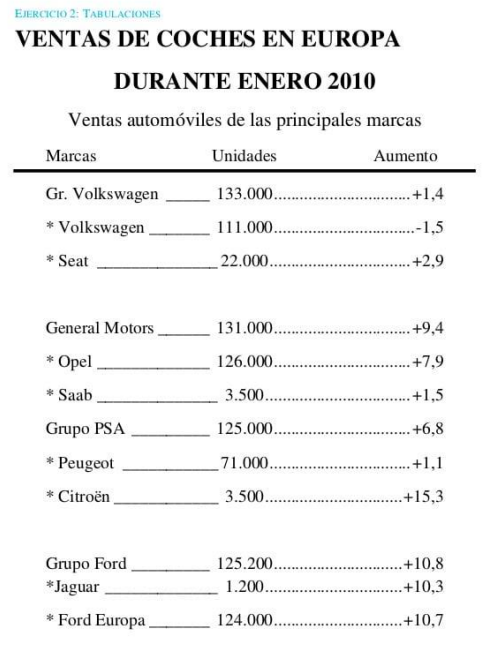

## Índex
- [Índex](#índex)
- [Introducció](#introducció)
- [Objectius](#objectius)
- [Pràctica 4](#pràctica-4)

## Introducció

La pràctica ens introdueix en l’ús bàsic de **LibreOffice**.

## Objectius

L’objectiu d’aquesta pràctica és comprovar si l’alumnat ha interioritzat els següents conceptes pràctics i sap dur-los a terme:

- Gràfics Estadístics.
- Crear taules.
- Formatar taules.
- Convertir text en taula.

\newpage

## Pràctica 4

1. Obri el document `taula.odt` i modifica’l per a que la taula quedi de la següent forma:
   
   - a. Mou la columna **Medallas Bronce** a la segona posició.
   - b. Mou la columna **medalles oro** a la última posició.
   - c. Mou la fila de **Jaume** a la segona posició, just la primera després de la fila de títols.
   - d. Indica com has realitzat cada pas, escrivint-ho baix de la taula.

2. Crea una nova taula baix de l’actual, que serà una taula de càlcul. La taula tindrà el següent format:
   
   - a. Les columnes **Total**, **Total + IVA** i la fila **TOTAL** han de calcular-se a partir dels elements de la taula **Cantidad** i **Precio unitario**.

3. A continuació de la taula, crea l’esquelet de navegació següent. Recorda que sols has de escriure el que NO està entre parèntesi i has de aplicar-li l’estil que es marca entre parèntesi.

- Portada (Estilo predeterminado)
- Indice (Estilo predeterminado) 
- Glosario (Título 1) 
- Introducción (Título 1) 
- Primer capítulo (Título 1) 
- Apartado 1 (Título 2) 
- Subapartado 1.1 (Título 3) 
- Subapartado 1.2 (Título 3) 
- Subapartado 1.3 (Título 3) 
- Apartado 2 (Título 2) 
- Apartado 3 (Título 2) 
- Segundo capítulo (Título 1) 
- Apartado 1 (Título 2) 
- Apartado 2 (Título 2) 
- Capítulo tercero (Título 1) 
- Apartado 1 (Título 2) 
- Apartado 2 (Título 2) 
- Conclusiones y reflexiones (Título 1) 
- Anexos (Título 1) 
- Anexo I (Título 2) 
- Anexo II (Título 2) 
- Anexo III (Título 2) 
- Anexo IV (Título 2)

4. Fes una captura mostrant el navegador i pega-la en el document, just darrere de l’esquelet que acabes de crear.

\newpage 
   
5. Afegeix a continuació la següent llista:

{ width=300 margin=auto }

6. Afegeix una fulla nova i reprodueix de la forma més exacta possible, el document que s’adjunta en la següent pàgina:

{ width=400 margin=auto }

\newpage

7. Copia el següent text a continuació en una fulla nova:

Devuelven el canon de los CD a un abogado que los usó para copiar juicios. 

Un juzgado de Sevilla ha ordenado devolver el llamado 'canon digital' a un abogado que demostró que usó los CD para copiar juicios, que son actos públicos, y por lo tanto no los utilizó para reproducir obras protegidas por derechos de propiedad intelectual. 

Una sentencia del Juzgado de lo Mercantil 1 de Sevilla condena a un comerciante a devolver al abogado Joaquín Moeckel 1,12 euros, importe del 'canon digital' de cuatro CD que, según demostró en el juicio, utilizó para reproducir otras tantas actividades judiciales. 

Según la sentencia, con ello "queda suficientemente acreditado que el destino o uso final" de los CD no fue la copia privada, que es el objetivo del 'canon digital' que, tras ser abonado al comerciante, cobra la Sociedad General de Autores de España (SGAE).

Ara canvia el interlineat i les sangries de cada paràgraf:

1. El títol: tamany 22, negreta i Arial. La resta del text a Arial 12 (mentre no s’indique el contrari).
2. Primer paràgraf: interlineat doble, sangria abans i després de 0.5cm. Sangria de primera línia de 1 cm i justificat.
3. Segon paràgraf: sangries de primera línia i abans de 1 cm, justificat i interlineat de 0,40cm.
4. Tercer paràgraf: no té sangria de primera línia, les sangries després i abans del text de 3 cm, justificat, lletra tamany 20 i interlineat de 1'5.

\begin{tcolorbox}[colback=customblue!5!white, colframe=customblue!80!black, title=Nota]
GUARDA EL DOCUMENT AMB EL NOM: `practica4.odt` i exporta’l també com `practica4.pdf` i puja els documents a la plataforma.
\end{tcolorbox}
