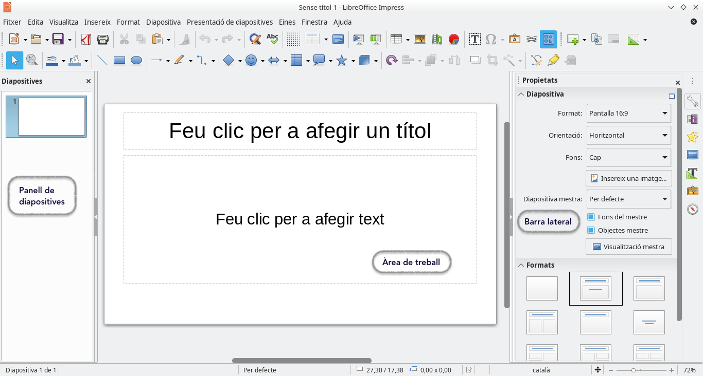

## Introducció a LibreOffice Impress

**LibreOffice Impress** és un programari de presentacions que forma part de la suite d'ofimàtica de LibreOffice. Permet crear presentacions visuals atractives i professionals que són útils tant en l'àmbit acadèmic com en el professional. Amb una sèrie d'eines i funcionalitats, Impress facilita la creació de diapositives dinàmiques i ben dissenyades.

### Importància de LibreOffice Impress

- **Facilitat d'ús**: 
    - Impress ofereix una interfície intuïtiva que ajuda als usuaris, independentment del seu nivell d'experiència, a crear presentacions d'aspecte professional.
    - La funcionalitat de **"Disseny de diapositives"** permet aplicar estils i temes predefinits que simplifiquen la personalització.

- **Compatibilitat amb altres formats**: 
    - Permet obrir i guardar presentacions en formats com .pptx (PowerPoint) i .odp (OpenDocument Presentation), cosa que facilita la col·laboració amb usuaris que utilitzin altres programaris.
    - Inclou la possibilitat d'exportar presentacions com a PDF, la qual cosa és útil per a la distribució de documents sense modificar.

- **Opcions de personalització**: 
    - Els usuaris poden triar entre una àmplia gamma de plantilles i dissenys, així com crear els seus propis dissenys personalitzats.
    - Efectes d'animació i transicions de diapositives permeten afegir interactivitat i dinamisme a les presentacions.

### Navegació per la Interfície d'Usuari

La interfície d'usuari de LibreOffice Impress és clara i ben estructurada, facilitant la seva navegació. A continuació es detallen els components principals:

1. **Menús**: 
   - Impress inclou menús que agrupen funcionalitats per categories:
     - **Fitxer**: Opcions per obrir, guardar i imprimir presentacions.
     - **Editar**: Funcions per desfer, refer i copiar.
     - **Visualitzar**: Modes de visualització (normal, presentació, etc.).
     - **Insertar**: Per afegir noves diapositives, imatges, gràfics, vídeos, etc.
     - **Format**: Opcions per aplicar formats de text, fons i disseny a les diapositives.
     - **Eines**: Funcions addicionals per gestionar presentacions.

2. **Barres d'eines**: 
   - Les barres d'eines es troben a la part superior de la finestra i contenen icones d'accés ràpid per a les funcionalitats més utilitzades:
     - **Nova Diapositiva**: Inserir diapositives en blanc o amb un disseny predefinit.
     - **Afegir Imatges**: Insertar imatges des de l'ordinador o des de fonts en línia.
     - **Efectes d'Animació**: Aplicar animacions a text i gràfics.

3. **Panell de diapositives**: 
   - Situat a l'esquerra de la finestra, mostra una miniatura de cada diapositiva dins de la presentació.
   - Permet reordenar les diapositives arrossegant-les i facilitar la visualització de l'estructura de la presentació.

4. **Àrea de treball**: 
   - És l'espai central on es dissenyen i editen les diapositives. Aquí, els usuaris poden:
     - Afegir text: Escrivint directament a la diapositiva o importat des de documents externs.
     - Insertar gràfics i imatges: Arrossegant arxius o utilitzant el menú **Insertar**.
     - Aplicar formats: Utilitzant les opcions de la barra d'eines i el menú de format.

5. **Barra d'estat**: 
   - A la part inferior de la finestra, proporciona informació sobre la diapositiva actual, incloent la numera de la diapositiva, la quantitat total de diapositives, i les eines de zoom.
   - Inclou també indicadors sobre les configuracions de presentació i la possibilitat de gestionar transicions i efectes.

La familiarització amb la interfície d'usuari de LibreOffice Impress és fonamental per crear presentacions eficaces. Comprendre com navegar per menús, barres d'eines i panells permet als usuaris aprofitar al màxim les funcionalitats que aquest programari ofereix, millorant així la seva capacitat de comunicar idees i continguts de manera visual i atractiva.

## Personalització de l'Entorn de Treball

Una de les grans avantatges de **LibreOffice Impress** és la seva capacitat de personalització, la qual permet adaptar l'entorn de treball a les preferències personals de l'usuari. Aquesta personalització ajuda a millorar l'eficiència i a optimitzar el flux de treball, ja que es poden accedir més ràpidament a les eines i funcions que més es necessiten.

### Configuració de Preferències Personals

Per personalitzar l'entorn de treball a **LibreOffice Impress**, es poden ajustar diversos paràmetres des del menú de **Preferències** (a **Eines > Opcions**). Aquest menú ofereix un ampli ventall de configuracions que afecten tant l'aspecte visual del programa com el seu comportament general.

#### 1. Opcions Generals
- **Idioma i Localització**:
  - Canvieu l'idioma de la interfície d'usuari i el corrector ortogràfic.
  - Estableix les opcions regionals, com ara el format de data, hora i moneda, per adaptar-se a les necessitats de l'usuari.
  
- **Desament Automàtic**:
  - Podeu configurar l'interval de desament automàtic per evitar la pèrdua de dades en cas d'interrupcions inesperades. Aquesta funció desa el vostre treball en intervals regulars, evitant que perdeu contingut en cas d'una apagada o error del sistema.

- **Unitats de Mesura**:
  - Configureu les unitats de mesura (centímetres, polzades, etc.) per ajustar-les a les vostres preferències a l'hora de dissenyar diapositives o definir la mida de text i objectes.

- **Comportament del Cursor i del Ratolí**:
  - Personalitzeu com es comporten el cursor i el ratolí a l’hora d’editar diapositives. Podeu ajustar, per exemple, la velocitat de desplaçament o la sensibilitat al seleccionar objectes.

#### 2. Personalització de Colors i Temes
- **Aparença de la Interfície**:
  - Trieu diferents esquemes de colors per a la interfície d’usuari. Això pot ser útil per reduir la fatiga visual o adaptar l'entorn a preferències estètiques.
  
- **Fons de Pantalla**:
  - Podeu ajustar els colors o imatges de fons en les àrees de treball i panells laterals, fent l'entorn més còmode i visualment agradable.

- **Icones i Mida de les Icones**:
  - Seleccioneu diferents estils d'icones (clàssic, modern, minimalista) i ajusteu-ne la mida, per facilitar la visualització de les opcions en pantalles grans o petites.

### Personalització de la Barra d'Eines i Accés Ràpid

A **LibreOffice Impress** podeu modificar les **barres d'eines** per adaptar-les a les vostres necessitats específiques, eliminant o afegint funcions que utilitzeu amb més freqüència. Això us permet accedir de manera ràpida a les eines més importants, agilitzant el procés de creació de presentacions.

#### 1. Personalització de la Barra d'Eines

Per modificar la barra d'eines, seguiu aquests passos:

1. Aneu a **Eines** > **Personalitza** > **Barres d'eines**.
2. Trieu la barra d'eines que voleu modificar del desplegable (per exemple, "Barra Estàndard" o "Barra de Dibuix").
3. Feu clic a **Afegeix** per inserir noves funcionalitats o icones a la barra d'eines:
   - Podreu seleccionar entre una llista de funcions agrupades per categories (per exemple, **Fitxer**, **Editar**, **Visualitzar**, etc.).
   - Marqueu les funcions que voleu afegir a la barra d'eines i feu clic a **D'acord**.
4. Per eliminar una eina de la barra, simplement desmarqueu-la de la llista o seleccioneu-la i feu clic a **Eliminar**.

#### 2. Personalització del Menú d'Accés Ràpid

El **Menú d'Accés Ràpid** és una barra d'eines personalitzada que podeu crear amb les funcions que utilitzeu més sovint. Això és especialment útil si preferiu tenir un conjunt reduït d'eines que necessiteu al vostre abast immediatament.

1. Aneu a **Eines** > **Personalitza** > **Barres d'eines** i seleccioneu **Nova**.
2. Doneu un nom a la vostra nova barra d’eines (per exemple, **Accés ràpid personalitzat**).
3. Afegiu les funcions més utilitzades a aquesta barra:
   - Seleccioneu les funcions i eines que voleu incloure en el menú d'accés ràpid i feu clic a **Afegeix**.
4. Un cop creada, aquesta barra d’eines apareixerà a la part superior o inferior de la pantalla, segons la vostra configuració.

#### 3. Personalització de Tecles de Drecera

Les **tecles de drecera** (o dreceres de teclat) són combinacions de tecles que permeten accedir ràpidament a funcions específiques sense necessitat de fer clic en cap menú. Això permet treballar de manera més eficient i ràpida. Per personalitzar les dreceres de teclat:

1. Aneu a **Eines** > **Personalitza** > **Tecles de Drecera**.
2. A la finestra emergent, seleccioneu una drecera preexistent que voleu modificar o creeu-ne una de nova.
3. Assigneu una funció a la combinació de tecles desitjada. Per exemple, podeu assignar **Ctrl + M** per inserir una nova diapositiva.

### Exemple Pràctic de Personalització

Si esteu treballant en una presentació que requereix la inserció freqüent d'imatges i formes geomètriques, podríeu:

1. **Afegir les eines d'inserció d'imatges** i **formes** a la vostra barra d'eines personalitzada.
2. Assignar una drecera, com per exemple **Ctrl + Shift + I**, per a la inserció ràpida d'imatges.

Aquesta personalització us permetrà accedir ràpidament a les eines més rellevants, augmentant la velocitat i eficàcia del vostre flux de treball.

La capacitat de personalitzar l'entorn de treball de **LibreOffice Impress** permet als usuaris ajustar el programa a les seves necessitats específiques. Configurar preferències personals i optimitzar la barra d'eines i els menús d'accés ràpid pot ajudar a treballar de manera més eficient, millorant l'experiència de l'usuari en la creació de presentacions.

