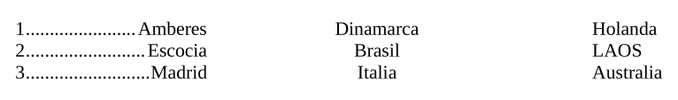
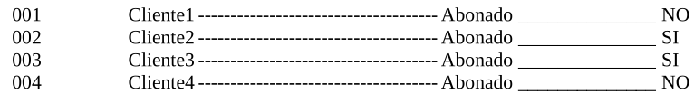

## Índex
1. [Introducció](#introduccio)
2. [Objectius](#objectius)
3. [Pràctica](#practica)

## Introducció

Aquesta pràctica introdueix l’ús bàsic de LibreOffice Writer, amb èmfasi en marcs, FontWork, estils i l’ús de plantilles, així com altres funcions com els tabuladors i la creació de pàgines.

## Objectius

L'objectiu d'aquesta pràctica és que l’alumnat practiqui els següents conceptes:

- Ús de marcs.
- Aplicació de FontWork.
- Creació i modificació d'estils.
- Gestió de plantilles de documents.
- Ús d'assistents.
- Ús de tabuladors i correcció ortogràfica.

\vfill

\begin{center}
\includegraphics[height=32pt]{../../../assets/llicencia.png}
\end{center}

\begin{center}
\footnotesize{
\textit{Apunts Aplicacions Ofimàtiques - 1SMX} by \href{https://github.com/abeneto}{Alberto Benetó} is licensed under \href{https://creativecommons.org/licenses/by-nc-sa/4.0/?ref=chooser-v1}{Creative Commons Attribution-NonCommercial-ShareAlike 4.0}
}
\end{center}

\newpage

## Pràctica

### 1. Text inicial:
Reprodueix el següent text en un nou document de Writer:

::: center
**Broncano como síntoma**
:::

_El éxito de audiencia de ‘La revuelta’ demuestra que hay un público para la innovación y el humor lejos de la polarización política_

El éxito de audiencia de La revuelta, el nuevo programa de David Broncano en TVE, ha sido una sorpresa y un soplo de renovación en el poco arriesgado panorama audiovisual. Incluso se puede interpretar como un síntoma de que buena parte de la sociedad busca divertirse sin los truenos del apocalipsis que resuenan en determinados medios y redes sociales. Quedan muchas noches de duelo televisivo, pero ahora todos intentan encontrar explicaciones a los excelentes resultados de su arranque, que casi ningún experto hubiera vaticinado. En sus dos primeras semanas de emisión, la cuota de pantalla de La revuelta osciló entre el 17% y el 19%, lo que duplica la audiencia media de la cadena y la que habitualmente tenía La 1 en ese horario la temporada pasada. Casi 16 millones de españoles, uno de cada tres, lo han visto en algún momento.

De entrada, se observa que La revuelta ha atraído a espectadores que hasta este estreno no seguían la televisión pública, incluso que habían dejado de ver la televisión lineal. El programa ha recuperado a un público joven —con días en los que más del 34% de su audiencia han sido menores de 45 años—, a consumidores de plataformas digitales y también de las cadenas privadas de todas las edades. La apuesta de Broncano y su equipo ha mantenido las mismas señas de identidad de La resistencia, con las que triunfó en Movistar+ y en su canal de Youtube. Con su llegada a TVE ha demostrado que hay muchos espectadores deseando ver registros más desenfadados que los que dominan en la televisión actual, donde apenas ha habido innovación en los últimos años, en parte debido a la enorme competencia de las plataformas digitales. La mayoría de los programas son clones de fórmulas repetidas hace décadas.

Pero el éxito de La revuelta demuestra más: que hay un lugar lejos de la polarización malhumorada, que millones de personas creen que no todo se puede leer en clave de trinchera ideológica y que reírse es un antídoto contra la bronca.

Referencia: Editorial El País, 2024

### 2. Creació de marcs:
- Retalla el títol i els dos primers paràgrafs. Crea un **marc** i enganxa el contingut dins d'aquest.
- Crea **dos nous marcs** i distribueix-los al llarg del document. Un d'ells ha d'estar centrat horitzontalment, i l'altre alineat a l'esquerra. Tindran una amplada de **5,60 cm**.
  - **Marc 1**: "No se pudo usar el nombre de La Resistencia por motivos legales"
  - **Marc 2**: "La irrupción de La Revuelta en TVE ha hecho crecer la audiencia un 8%"

### 3. FontWork:
- Afegeix una portada amb un text **FontWork** amb el títol: "**Artículo de opinión**".
- Afegeix les teves dades personals (nom, cognoms, data del treball) dins d'un **marc** amb amplada de **10,25 cm** i alçada de **1,38 cm**.

### 4. Creació d’estils:
Crea els següents **estils** i aplica’ls al document:

- **Estil Títol Noticia**: 20pt, Liberation Serif, negreta, centrat.
- **Estil Subtítol Noticia**: 16pt, Times New Roman, cursiva, centrat.
- **Estil Títol Referències**: 10pt, Times New Roman, cursiva, subratllat.

### 5. Aplicació d’estils:
- Aplica l'**Estil Títol Noticia** al títol: "_Broncano como síntoma_".
- Aplica l'**Estil Subtítol Noticia** al subtítol: "_El éxito de audiencia de ‘La revuelta’ demuestra que hay un público para la innovación y el humor lejos de la polarización política_"
- Aplica l'**Estil Títol Referències** a la referència al final del text.

### 6. Estil de paràgraf llarg:
- Crea un nou estil anomenat **Estil Paràgraf Llarg** amb una mida de lletra de **16pts** i aplica’l al paràgraf més llarg del document.

### 7. Inserció de pàgines:
- Inserta una nova pàgina en horitzontal i escriu "**Bibliografia**" amb l'**Estil Títol 1**.

### 8. Afegir enllaços:
- Afegeix un parell d'enllaços.

### 9. Inserció d’imatges:
- Inserta dues imatges de Wikipedia i Google al document.

### 10. Tabuladors:
- Inserta una nova pàgina en **vertical** i utilitza **tabuladors** per reproduir el següent text:

- Completa la pàgina amb aquest altre text utilitzant també tabuladors:

### 11. Correcció ortogràfica:
- Realitza una **correcció ortogràfica** de tot el document per assegurar que no hi ha errors.
  
\begin{tcolorbox}[colback=customblue!5!white, colframe=customblue!80!black, title=Nota]
Guarda el document generat com `Prac-2.odt`.
\end{tcolorbox}
