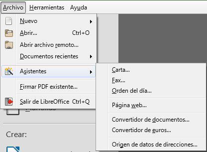

## Assistents

Els **assistents** a LibreOffice Writer són eines que automatitzen el procés de creació de documents predefinits. Aquestes eines us guien pas a pas per generar documents amb formats estàndard, com ara cartes, faxos, informes o fins i tot plantilles personalitzades. Els assistents redueixen el temps necessari per configurar un document des de zero, garantint que s'apliquin formats correctes i uniformes.

### Tipus d'Assistents

LibreOffice Writer ofereix diversos assistents que podeu utilitzar segons les vostres necessitats:

- **Assistents de carta**: Us ajuda a redactar cartes formals o informals, amb la possibilitat de seleccionar diferents formats de capçalera, peu de pàgina, adreces i salutacions.
  
- **Assistents de fax**: Facilita la creació de cobertes de fax amb informació sobre el destinatari, l’emissor i els detalls del missatge.

- **Assistents d'informes**: Automatitza la creació d'informes llargs i complexos, estructurant-los amb seccions, títols i taules de contingut.

- **Assistents de presentacions**: Si necessiteu crear una presentació a partir de dades, LibreOffice ofereix un assistent per a Impress, l'eina de presentacions de la suite. Això permet generar presentacions coherents amb estils predefinits.



### Com utilitzar un assistent

Per accedir als **assistents** en Writer, seguiu els passos següents:

1. Aneu al menú superior i seleccioneu **Fitxer** > **Assistents**.
2. Trieu l'assistent adequat per al tipus de document que voleu crear, com ara **Carta**, **Fax** o **Informe**.
3. L'assistent us guiarà a través de diversos passos, on podreu triar opcions com el format del document, l'estil de la capçalera i peu de pàgina, i l'estructura general.
4. Un cop hagueu completat totes les opcions, feu clic a **Finalitza**. El document es generarà automàticament amb les opcions seleccionades.

### Configuració dels assistents

#### Assistents de Carta

L'**assistent de carta** us permet generar cartes formals o informals amb diferents opcions de format. Els passos per crear una carta amb aquest assistent són els següents:

1. **Inici**: Trieu si voleu crear una carta personal o de negocis.
2. **Selecció de disseny**: Trieu el format de la carta. Podeu seleccionar capçalera, peu de pàgina i altres detalls de presentació.
3. **Informació de l'emissor i el destinatari**: Introduïu l'adreça de l'emissor, el destinatari i altres detalls com el títol, nom o data.
4. **Salutació i tancament**: Seleccioneu la salutació i el tancament adequats, que poden variar en funció del tipus de carta que estigueu redactant.
5. **Finalització**: L'assistent crearà la carta amb el format seleccionat. Podeu modificar-la posteriorment per afegir el cos del text.

#### Assistents d'Informe

L'**assistent d'informes** permet crear informes llargs amb múltiples seccions. Els passos són similars:

1. **Inici**: Trieu el tipus d'informe que voleu crear.
2. **Estructura**: Definiu les seccions de l'informe, com ara la introducció, els capítols i la conclusió.
3. **Taula de contingut**: L'assistent pot generar automàticament una taula de contingut basada en els títols del document.
4. **Format**: Seleccioneu l'estil d'informe i altres aspectes com numeració de pàgines, format de capçaleres i peus de pàgina.
5. **Finalització**: Un cop completats tots els passos, l'informe es genera i queda llest per ser modificat o imprès.

### Exemple pràctic: Creació d'una carta amb assistent

Suposem que voleu crear una **carta formal** utilitzant l'assistent de LibreOffice Writer. Seguiu aquests passos:

1. Aneu a **Fitxer** > **Assistents** > **Carta**.
2. Trieu l'opció de **carta de negocis**.
3. A la finestra següent, seleccioneu un format amb **capçalera i peu de pàgina**.
4. Introduïu les dades del **remitent** i del **destinatari**, com ara nom, adreça i data.
5. Trieu una salutació formal com ara *Benvolgut/da Sr./Sra.*
6. Configureu un tancament formal com ara *Atentament*.
7. Feu clic a **Finalitza** i l'assistent generarà la carta amb el format seleccionat.

El resultat seria un document amb l'encapçalament, peu de pàgina, salutació i tancament ja configurats, a punt per afegir el cos de la carta.

```plaintext
[Nom del remitent]
[Adreça del remitent]
[Data]

Benvolgut/da Sr./Sra. [Nom del destinatari],

[Cos de la carta]

Atentament,

[Nom del remitent]
```

### Avantatges dels assistents
Els assistents de LibreOffice Writer ofereixen diversos avantatges:

- Estalvi de temps: Automatitzen tasques repetitives, com la configuració d'estils, capçaleres i peus de pàgina.
- Consistència: Asseguren que els documents segueixin un format i estil uniformes.
- Facilitat d'ús: Són fàcils d'utilitzar fins i tot per a persones amb poca experiència en la creació de documents complexos.
- Personalització: Els documents creats amb assistents es poden modificar posteriorment, permetent una gran flexibilitat.