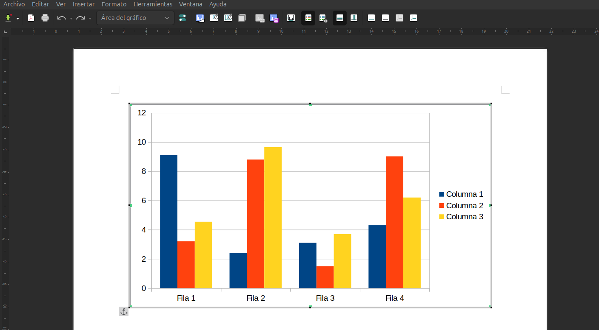
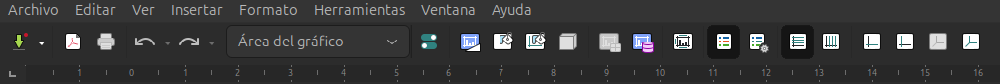

## Gràfics Estadístics

LibreOffice Writer inclou un **mòdul de gràfics** que permet generar i personalitzar gràfics estadístics directament en els documents. Aquest mòdul ofereix funcions similars a les de LibreOffice Calc, fent que l'ús de gràfics a Writer sigui senzill i eficient. Els gràfics es poden crear a partir de taules de dades i s'adapten automàticament al contingut inserit.

### Tipus de Gràfics

Els gràfics que es poden generar en LibreOffice Writer inclouen una àmplia varietat de tipus, segons les necessitats de representació visual de les dades:

- **Gràfic de columnes**: Adequat per a comparar categories diferents o mostrar canvis en el temps.
- **Gràfic de barres**: Similar al de columnes, però amb les barres disposades horitzontalment, ideal per a visualitzar diferències entre grups.
- **Gràfic de línies**: Mostra l'evolució d'una sèrie de dades al llarg del temps o altres variables contínues.
- **Gràfic circular**: Ideal per a visualitzar parts d'un tot, on cada secció representa una proporció del total.
- **Gràfic de dispersió**: Utilitzat per a visualitzar la relació entre dues variables diferents, mostrant punts de dades en un gràfic de coordenades.
- **Gràfic d'àrea**: Similar al de línies, però amb l'àrea sota la línia ombrejada, permetent una comparació visual més clara de diferents sèries de dades.

### Com Crear un Gràfic en Writer

Per generar un gràfic estadístic en un document de Writer, seguiu aquests passos:

1. **Inserir una taula de dades**: Abans de crear un gràfic, necessiteu tenir una taula de dades en el vostre document. Podeu crear una taula de dades des de zero o importar-la des d'un altre document.
2. **Seleccionar les dades**: Marqueu les cel·les que contenen les dades que voleu representar gràficament.
3. **Crear el gràfic**: 
   - Aneu a **Inserir** > **Gràfic** al menú superior.
   - S'obrirà l'assistent de creació de gràfics, que us guiarà en la selecció del tipus de gràfic.
4. **Personalitzar el gràfic**: Després de triar el tipus de gràfic, podreu personalitzar-ne els elements, com ara títols, etiquetes, llegendes i colors.
5. **Finalitzar**: Feu clic a **Finalitza** per inserir el gràfic generat en el document.

### Personalització del Gràfic

Després de crear el gràfic, LibreOffice Writer permet fer diverses **modificacions** per adaptar-lo a les vostres necessitats. Alguns dels elements que podeu personalitzar inclouen:

- **Títol**: Podeu afegir un títol descriptiu al gràfic, per clarificar la informació que mostra.
- **Eixos**: Els eixos X i Y poden tenir títols específics i unitats per donar més detalls sobre les dades representades.
- **Escala i intervals**: És possible ajustar l'escala dels eixos i els intervals de les marques, segons la precisió que necessiteu en la visualització de les dades.
- **Línies de tendència**: En gràfics de línies i de dispersió, podeu afegir línies de tendència per mostrar la trajectòria general de les dades.
- **Colors i estils**: Els colors dels elements del gràfic, com les barres o les línies, es poden modificar per donar-los més claredat o adaptar-se a l'estil visual del document.

### Integració amb Calc

Si ja disposeu de dades a LibreOffice Calc, podeu **copiar i enganxar** els gràfics creats en Calc directament al vostre document de Writer. Aquesta funció manté la **interactivitat** del gràfic, de manera que si es modifica el gràfic original a Calc, el gràfic de Writer es pot actualitzar automàticament.

### Exemple pràctic: Creació d'un gràfic de columnes

Suposem que voleu crear un **gràfic de columnes** per mostrar les vendes mensuals d'una empresa. Heu de seguir aquests passos:

1. **Crear la taula de dades** amb les vendes mensuals:
   
   Mes         | Vendes
   Gener       | 5000
   Febrer      | 7000
   Març        | 6500
   Abril       | 8000

2. Seleccionar la taula de dades i anar a **Inserir** > **Gràfic**.
3. Trieu el tipus de gràfic **Columnes**.
4. Afegiu un títol com **Vendes mensuals del 2024** i etiqueteu els eixos (Eix X: *Mesos*, Eix Y: *Vendes en euros*).
5. Feu clic a **Finalitza** i el gràfic de columnes es mostrarà dins del document.

!!!note "**Nota**"
    "És important adonar-nos que quan entrem a editar el gràfic canvia el menu superior, ja que s'adequa al context i ens permet realitzar l'edició del gràfic que acabem de crear"

### Avantatges de l'ús de Gràfics

Els gràfics a LibreOffice Writer ofereixen nombrosos avantatges:

- **Claredat visual**: Faciliten la comprensió de dades numèriques o estadístiques, oferint una representació visual atractiva i clara.
- **Integració senzilla**: Poden crear-se directament dins de Writer o importar-se fàcilment des d'altres aplicacions de LibreOffice com Calc.
- **Personalització avançada**: Els gràfics es poden adaptar a les necessitats estètiques i funcionals del document.
- **Actualització automàtica**: Els gràfics vinculats amb fulls de càlcul poden actualitzar-se automàticament en modificar les dades originals.

Amb aquests recursos, els **gràfics estadístics** a LibreOffice Writer són una eina potent per a la presentació de dades de manera visualment impactant i fàcil d'entendre.