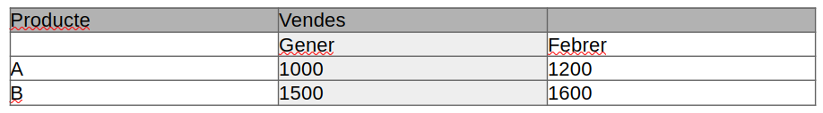

## Combinació de Cel·les en Taules

A **LibreOffice Writer**, la combinació de cel·les permet unificar dues o més cel·les adjacents en una de sola. Aquesta funcionalitat és útil per millorar la presentació de les dades i adaptar l'estructura de la taula a les necessitats del contingut, com ara crear capçaleres que abastin diverses columnes o agrupar informació relacionada.

### Quan utilitzar la combinació de cel·les

Combinar cel·les és especialment útil en els següents casos:

- **Capçaleres complexes**: Quan voleu crear una capçalera de taula que cobreixi diverses columnes.
- **Agrupació de dades**: Per representar visualment que diverses files o columnes contenen informació relacionada.
- **Estètica de la taula**: Per simplificar la visualització d'informació en taules grans o complexes.

### Pas a pas: Com combinar cel·les

Seguiu aquests passos per combinar cel·les en una taula de **LibreOffice Writer**:

1. **Seleccionar les cel·les**: Primer, seleccioneu les cel·les que voleu combinar. Aquestes cel·les han d'estar adjacents, ja sigui en files o columnes.
   
   Exemple: Si voleu combinar dues cel·les de la primera fila d'una taula de tres columnes, seleccioneu les dues primeres cel·les de la fila.

2. **Anar al menú Taula**: Un cop seleccionades les cel·les, aneu al menú superior i seleccioneu **Taula** > **Combina cel·les**.

3. **Cel·les combinades**: Les cel·les seleccionades es combinaran en una única cel·la més gran. El contingut de totes les cel·les es fusionarà en una de sola.

### Exemple pràctic: Crear una capçalera de taula combinada

Suposem que teniu la següent taula amb informació sobre vendes, i voleu combinar les cel·les de la primera fila per crear una capçalera més clara.

Abans de combinar:

Després de combinar la primera fila:

### Dividir cel·les combinades

Si voleu **dividir** cel·les que prèviament heu combinat, seguiu aquests passos:

1. **Seleccionar la cel·la combinada**: Feu clic a la cel·la que voleu dividir.
2. **Anar al menú Taula**: Aneu a **Taula** > **Divideix cel·les**.
3. **Configurar la divisió**: Especifica com voleu dividir la cel·la (en files o columnes) i el nombre de parts.
4. **Finalitzar**: Feu clic a **D'acord** i la cel·la es dividirà en tantes parts com heu especificat.

### Avantatges de combinar cel·les

- **Millor presentació visual**: Permet crear dissenys de taula més flexibles i adaptats a les dades.
- **Capçaleres més clares**: Facilita la creació de capçaleres que agrupen diverses categories d'informació.
- **Flexibilitat**: Podeu modificar la taula en qualsevol moment, combinant i dividint cel·les segons les necessitats del document.

La combinació de cel·les és una eina molt útil a **LibreOffice Writer** per gestionar taules complexes i millorar la comprensió visual de les dades.
