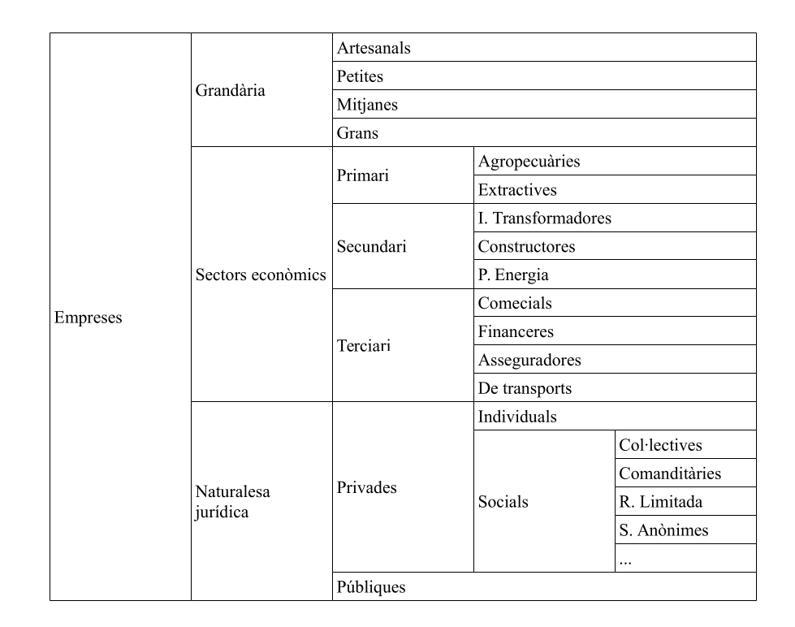

## Índex
1. [Introducció](#introduccio)
2. [Objectius](#objectius)
3. [Activitat 11](#activitat-11)
4. [Activitat 12](#activitat-12)
5. [Activitat 13](#activitat-13)

## Introducció

La pràctica ens introdueix en l'ús dels gràfics i taules en **Writer**.

## Objectius

- Gràfics estadístics
- Introducció a les taules
- Crear taules
- Formatar taules
- Convertir text en taula

\vfill

\begin{center}
\includegraphics[height=32pt]{../../../assets/llicencia.png}
\end{center}

\begin{center}
\footnotesize{
\textit{Apunts Aplicacions Ofimàtiques - 1SMX} by \href{https://github.com/abeneto}{Alberto Benetó} is licensed under \href{https://creativecommons.org/licenses/by-nc-sa/4.0/?ref=chooser-v1}{Creative Commons Attribution-NonCommercial-ShareAlike 4.0}
}
\end{center}

\newpage

## Activitat 11

### Objectiu:
Treballar amb gràfics estadístics.

### Desenvolupament de l’activitat:

#### Creació d’un gràfic

1. Obri el recurs `Resultados.odt` i trobaràs una taula.
2. Situat en qualsevol cel·la de la taula i inserta un Diagrama com el mostrat en `Sol_Act_11.pdf`.

\begin{tcolorbox}[colback=customblue!5!white, colframe=customblue!80!black, title=Nota]
Guarda el document generat com `Act-11.odt`.
\end{tcolorbox}

---

## Activitat 12

### Introducció a les taules

#### Objectiu:
L’objectiu d’esta Activitat és aprendre a crear i modificar taules.

### Desenvolupament de l’activitat:

1. Crea un document nou.
2. Inserta una taula de 3 columnes per 20 files.
   - Estableix:
     - Repetir títol: Activat (Les primeres 1 fila)
     - Permetre divisió de taula en pàgines i columnes: Desactivat
     - Inserir bordes
   - Polsa el botó **Acceptar**.
3. Introdueix la informació del fitxer `Sol_Act_12_1.pdf`.
4. Introdueix el títol de la taula.
5. Guarda el document amb el nom `paises.odt` per a la seua revisió.

#### Modificació del format d’una taula

1. Modifica la taula del fitxer `Paises.odt` perquè es paregui a la del fitxer `Sol_Act_12_2.pdf` i guarda-la amb el nom `situacion.odt`.

#### Modificació de les línies i dels colors de les cel·les

1. Modifica la taula del fitxer `situacion.odt` per a que es paregui a la del fitxer `Sol_Act_12_3.pdf` i guarda-la amb el nom `paises_colores.odt`.

\begin{tcolorbox}[colback=customblue!5!white, colframe=customblue!80!black, title=Nota]
Entrega els documents \texttt{situacion.odt} i \texttt{paises\_colores.odt}.
\end{tcolorbox}

---

## Activitat 13

### Objectiu:
Fusionar i dividir cel·les.

### Desenvolupament de l’activitat:

Crea una taula com la del fitxer `Sol_Act_13.pdf` realitzant les combinacions de cel·les adequades. El resultat final serà:

\begin{tcolorbox}[colback=customblue!5!white, colframe=customblue!80!black, title=Nota]
Guarda el document generat com `Act-13.odt`.
\end{tcolorbox}
