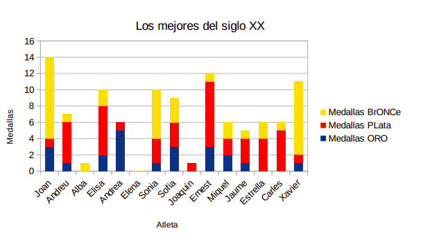

\vfill

\begin{center}
\includegraphics[height=32pt]{../../../assets/llicencia.png}
\end{center}

\begin{center}
\footnotesize{
\textit{Apunts Aplicacions Ofimàtiques - 1SMX} by \href{https://github.com/abeneto}{Alberto Benetó} is licensed under \href{https://creativecommons.org/licenses/by-nc-sa/4.0/?ref=chooser-v1}{Creative Commons Attribution-NonCommercial-ShareAlike 4.0}
}
\end{center}

\newpage

# 1. Introducció
La pràctica introdueix l'ús bàsic de LibreOffice.

# 2. Objectius
L'objectiu d'aquesta pràctica és comprovar si l’alumnat ha assimilat els següents conceptes pràctics i sap com aplicar-los:
- Gràfics estadístics
- Creació de taules
- Formatació de taules
- Conversió de text a taula

# 3. Pràctica

## 3.1. Recreació de taula
Reprodueix la següent taula:

| NOMBRE   | MEDALLAS ORO | MEDALLAS PLATA | MEDALLAS BRONCE |
|----------|--------------|----------------|-----------------|
| Joan     | 3            | 1              | 10              |
| Andreu   | 1            | 5              | 1               |
| Alba     | 0            | 0              | 1               |
| Elisa    | 2            | 6              | 2               |
| Andrea   | 5            | 1              | 0               |
| Elena    | 0            | 0              | 0               |
| Sonia    | 1            | 3              | 6               |
| Sofia    | 3            | 3              | 3               |
| Joaquín  | 0            | 1              | 0               |
| Ernest   | 3            | 8              | 1               |
| Miquel   | 2            | 2              | 2               |
| Jaume    | 1            | 3              | 1               |
| Estrella | 0            | 4              | 2               |
| Carles   | 0            | 5              | 1               |
| Xavier   | 1            | 1              | 9               |

I aplica estils per a que quede el més semblant possible a aquesta:

\newpage

## 3.2. Generació de gràfic
Crea un gràfic amb les dades de la taula anterior i afegeix-lo just sota la taula.

\newpage

## 3.3. Creació de nova taula
Baix del gràfic, crea una taula amb les següents especificacions:
- **Taula de 25 files i 4 columnes**
- Repetició de les files de títol en noves pàgines
- Estil de taula: **Finanzas**
- Introdueix les següents dades:

| Fecha      | Bitcoin   | Ethereum | Doge     |
|------------|-----------|----------|----------|
| 22.09.2021 | 43.023,7  | 2.984,32 | 0,213940 |
| 21.09.2021 | 40.651,3  | 2.761,52 | 0,200575 |
| 20.09.2021 | 42.870,6  | 2.976,05 | 0,207600 |
| 19.09.2021 | 47.238,7  | 3.329,12 | 0,232971 |
| 18.09.2021 | 48.306,7  | 3.435,97 | 0,241378 |
| 17.09.2021 | 47.282,8  | 3.398,65 | 0,239833 |
| 16.09.2021 | 47.748,0  | 3.569,43 | 0,242142 |
| 15.09.2021 | 48.130,6  | 3.611,90 | 0,247400 |
| 14.09.2021 | 47.077,5  | 3.428,87 | 0,240342 |
| 13.09.2021 | 44.949,5  | 3.284,52 | 0,235823 |
| 12.09.2021 | 46.062,3  | 3.408,28 | 0,250623 |
| 11.09.2021 | 45.161,9  | 3.267,33 | 0,240969 |
| 10.09.2021 | 44.842,8  | 3.207,27 | 0,239565 |
| 09.09.2021 | 46.385,6  | 3.423,51 | 0,252357 |
| 08.09.2021 | 46.061,4  | 3.495,10 | 0,256726 |
| 07.09.2021 | 46.779,6  | 3.423,12 | 0,254302 |
| 06.09.2021 | 52.672,1  | 3.927,21 | 0,309001 |
| 05.09.2021 | 51.768,6  | 3.950,62 | 0,314393 |
| 04.09.2021 | 49.918,4  | 3.884,97 | 0,299222 |
| 03.09.2021 | 49.999,0  | 3.936,29 | 0,296052 |
| 02.09.2021 | 49.274,3  | 3.786,19 | 0,294913 |
| 01.09.2021 | 48.819,4  | 3.832,73 | 0,294338 |
| 31.08.2021 | 47.130,4  | 3.430,74 | 0,278231 |
| 30.08.2021 | 46.992,7  | 3.225,67 | 0,271949 |
| 29.08.2021 | 48.777,4  | 3.222,16 | 0,266967 |

## 3.4. Partició de la taula
Mou la taula cap avall suficient per dividir-la entre dues pàgines.

## 3.5. Gràfics per cada moneda
Genera un gràfic per a cadascuna de les monedes (*Bitcoin*, *Ethereum*, *Doge*) que mostri l'evolució del seu preu al llarg del temps.

## 3.6. Conversió de text a taula
Converteix el text situat en el fitxer *litecoin.odt* a una taula com les anteriors i genera un gràfic per aquesta.

## 3.7. Documentació del procés
Baix del gràfic, descriu els passos seguits per convertir el text en una taula.

## 3.8. Afegir noves files
Afegeix 3 files noves a cadascuna de les taules de *Bitcoin*, *Ethereum*, *Doge* i *Litecoin* amb dates i preus ficticis.

## 3.9. Eliminació de files
Elimina les 3 primeres files de cadascuna de les taules.

## 3.10. Formatació de les taules
Aplica el següent format a les taules de *Bitcoin*, *Ethereum*, *Doge* i *Litecoin*:
- Els títols de la primera fila en negreta, 18pt, Arial.
- Vores exteriors de 2 pts i interiors per defecte.
- Efecte "pijama": files imparells en blanc i files parells en gris clar 4.
- Ample de la darrera columna: 5 cm, la resta 3 cm.
- Centra les taules a la pàgina.

## 3.11. Taula addicional
Crea la taula següent combinant cel·les, files i columnes segons sigui necessari, i afegeix-la al final del document.

# 4. Guarda el document
Guarda el document amb el nom *practica3.odt*, exporta'l també com *practica3.pdf* i puja els documents a la plataforma.
