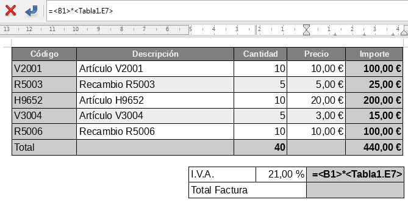

## Taules de càlcul

Les **taules de càlcul** dins de LibreOffice Writer són una eina potent per gestionar dades numèriques i informació organitzada de manera estructurada. Podreu inserir taules de càlcul dinàmiques directament dins del vostre document de text, cosa que us permetrà presentar informació precisa i fàcilment comprensible, així com fer càlculs automàtics i actualitzar dades sense haver de sortir de Writer.

### Integració amb Calc

LibreOffice Writer permet inserir **taules de càlcul de Calc**, l'eina de fulls de càlcul de la suite. Això és especialment útil si ja heu creat una taula de càlcul en Calc i voleu inserir-la en un document de text per mostrar resultats o fer càlculs dins d’un informe, carta o estudi.

### Com inserir una taula de càlcul

Per inserir una **taula de càlcul** dins d’un document de Writer, seguiu els passos següents:

1. Aneu al menú superior i seleccioneu **Inserir** > **Objecte** > **Full de càlcul**.
2. Això obrirà una nova taula de càlcul dins del vostre document. Podeu introduir dades, fórmules o importar una taula ja existent des de LibreOffice Calc.
3. Un cop inserida, podeu interactuar amb la taula com ho faríeu en un full de càlcul independent, però directament dins de Writer.

### Configuració de les taules de càlcul

Un cop inserida una taula de càlcul dins de Writer, podeu modificar diversos paràmetres per adaptar-la a les vostres necessitats:

- **Ample de columnes i alçada de files**: Podeu ajustar la mida de les columnes i files fent clic dret sobre els encapçalaments de la taula i seleccionant **Propietats**. Això us permetrà optimitzar l'espai i fer que les dades siguin fàcils de llegir.
  
- **Fórmules**: Les taules de càlcul dins de Writer poden utilitzar fórmules com a Calc. Per exemple, podeu sumar, restar, multiplicar o fer operacions més complexes directament dins de la taula.
  
- **Format de cel·les**: Com en qualsevol full de càlcul, podeu aplicar format a les cel·les per donar un estil més atractiu a la taula. Això inclou aplicar colors, canviar el tipus de lletra, afegir bordes i molt més.

### Com vincular taules de càlcul de Calc a Writer

Si ja teniu una taula de càlcul creada a LibreOffice Calc i voleu inserir-la dins de Writer mantenint-la sincronitzada amb l'original, podeu seguir aquests passos:

1. Aneu a **Fitxer** > **Inserir** > **Objecte** > **Full de càlcul de LibreOffice Calc**.
2. Seleccioneu l'arxiu de Calc que voleu inserir i feu clic a **D'acord**.
3. La taula de càlcul es vincularà amb el document de Writer, i qualsevol canvi fet a la taula en Calc es reflectirà automàticament a Writer.

### Ús de taules de càlcul per a càlculs automàtics

Un dels avantatges més grans de treballar amb taules de càlcul dins de Writer és la capacitat de fer càlculs automàtics. Podeu utilitzar funcions com ara sumes, mitjanes, màxims i mínims dins de la taula de càlcul per generar resultats immediatament.

#### Exemple pràctic: Crear una taula amb sumes automàtiques

Suposem que voleu crear una taula per sumar automàticament una sèrie de valors dins de Writer. Seguiu aquests passos:

1. Inseriu una taula de càlcul com s'ha descrit anteriorment.
2. Introduïu els valors a les cel·les, per exemple, en la columna A (A1:A5).
3. En la cel·la A6, introduïu la fórmula `=SUM(A1:A5)` per calcular la suma d'aquests valors.
4. El resultat apareixerà automàticament a la cel·la A6, actualitzant-se si es modifiquen els valors.

### Avantatges de les taules de càlcul

L'ús de taules de càlcul dins de LibreOffice Writer té múltiples avantatges:

- **Organització de dades**: Les taules de càlcul són ideals per presentar grans volums de dades numèriques de manera clara i ordenada.
- **Càlculs automàtics**: Podeu aplicar fórmules per fer càlculs automàtics dins de la taula, evitant errors i estalviant temps.
- **Actualització dinàmica**: Si inseriu una taula vinculada des de Calc, els canvis fets en el full de càlcul original es reflectiran automàticament en el document de Writer.
- **Formatació personalitzada**: Les taules de càlcul poden ser personalitzades amb diversos formats, com ara colors de fons, tipus de lletra i bordes per fer-les més llegibles i atractives.

### Exemple pràctic: Inserir una taula de càlcul existent

Si voleu inserir una taula de càlcul ja creada a Calc dins del vostre document de Writer, seguiu aquests passos:

1. Aneu a **Fitxer** > **Inserir** > **Objecte** > **Full de càlcul de LibreOffice Calc**.
2. Seleccioneu l'arxiu de Calc que conté la taula que voleu inserir.
3. La taula es mostrarà dins del vostre document de Writer. Podeu redimensionar-la o modificar-la com calgui.

Amb aquestes eines, podreu gestionar dades numèriques de manera dinàmica i eficient dins de LibreOffice Writer, mantenint el vostre document estructurat i amb informació actualitzada fàcilment.
